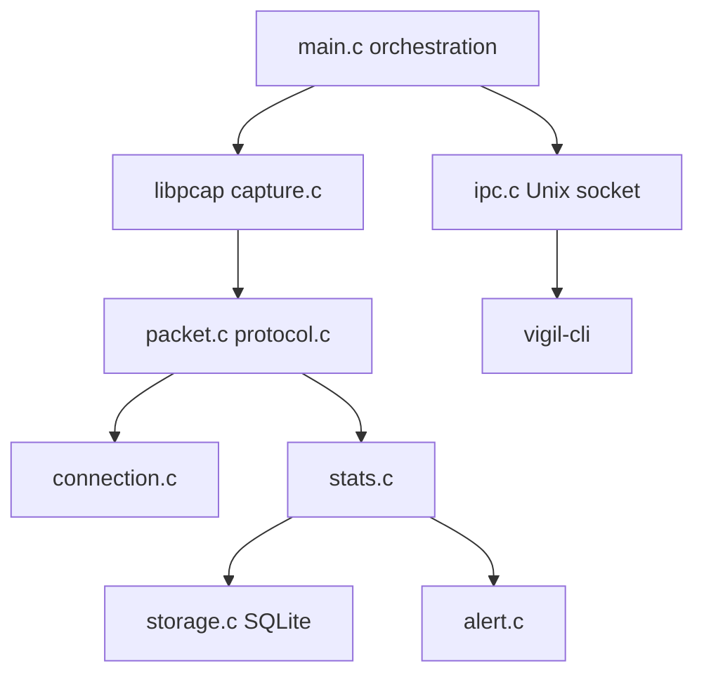

# vigil — Developer Training Guide

**Start here** if you are learning systems programming on a real C codebase.

## Who this is for

Backend and systems developers who want hands-on practice with:

- C99, daemons, and multi-file builds
- Network capture (libpcap), parsing, and connection tracking
- SQLite persistence, logging, and Unix-domain IPC
- Reading unfamiliar code, debugging, and shipping minimal fixes

This is **not** a test-plan-only exercise. You will build, run, review, and change production-shaped code.

## What you will practice

| Skill | How vigil supports it |
|-------|------------------------|
| Read unfamiliar code | Modular `src/` layout, headers, threads |
| Run and debug a daemon | `vigil` + `vigil-cli`, logs, config |
| Work from a specification | [wirestack-vigil-spec.md](../wirestack-vigil-spec.md) |
| Use automated tests | `make test`, integration scripts under `tests/integration/` |
| Ship focused changes | Fix or implement one capability at a time with tests |

## Prerequisites

- **Linux or WSL (Ubuntu)** — primary environment ([README.md](README.md) quickstart)
- Basic **C** (pointers, structs, `make`)
- Optional: **gdb**, `tcpdump` or traffic generation for capture exercises

## Environment setup

1. Follow the build and run steps in [README.md](README.md).
2. On WSL, use an **Ubuntu** terminal profile and:

   ```bash
   cd "/mnt/e/projects X/wirestack/vigil"
   ```

3. Use **two terminals** while developing:
   - Terminal A: `sudo ./vigil --config vigil.conf` (daemon, packet capture)
   - Terminal B: `./vigil-cli status` (and other commands)

4. Packet capture requires **`sudo`** (or `CAP_NET_RAW`). The CLI talks to the daemon over `/tmp/vigil.sock`.

## Architecture

High-level data flow:



| Component | Role |
|-----------|------|
| `main.c` | Startup, signal handling, main loops, wires subsystems |
| `capture.c` | libpcap live capture, invokes packet callback |
| `packet.c` / `protocol.c` | Parse frames, classify protocols |
| `connection.c` | 5-tuple table, TCP state, timeouts |
| `stats.c` | Traffic counters (PPS/BPS) |
| `storage.c` | SQLite persistence |
| `alert.c` | Threshold checks, external script hook |
| `logger.c` / `report.c` | Logs, rotation, periodic reports |
| `config.c` | INI file + CLI flags, reload |
| `multiface.c` | Multi-interface capture threads |
| `anomaly.c` | Baseline and statistical anomaly detection |
| `ipc.c` | Unix socket API for `vigil-cli` |
| `cli/` | Client: JSON over socket, terminal display |

Product capabilities by phase are summarized in [PRODUCT.md](PRODUCT.md).

## Repository map

```
vigil/
├── src/           # Daemon implementation
├── cli/           # vigil-cli client
├── tests/         # Check unit tests + integration/*.sh
├── vigil.conf.example
├── data/          # SQLite DB (gitignored at runtime)
└── logs/          # Log output (gitignored at runtime)
```

Full layout and APIs: [wirestack-vigil-spec.md](../wirestack-vigil-spec.md).

## Training workflows

Pick exercises assigned by your facilitator, or follow this progression:

### 1. Orient

- `make` and `make test`
- Copy `vigil.conf.example` → `vigil.conf`, set `interface` (e.g. `eth0` in WSL)
- Run the daemon and try: `status`, `stats`, `connections`, `protocols`, `alerts`, `report`, `reload`, `stop`

### 2. Implement

- Choose a phase or feature from [wirestack-vigil-spec.md](../wirestack-vigil-spec.md)
- Implement or complete stubs on your branch; add tests where the spec calls for them

### 3. Review

- Search for `// BUG VG-XXX` in `src/`
- For each assigned ID: document file, line, root cause, user-visible impact, and reproduction steps

### 4. Fix

- Patch on a **`fixes/`** or personal branch (not the shared training branch unless told otherwise)
- Add or update a unit/integration test that would have caught the defect
- Open a PR with a short “why” in the description

## Branches

| Branch | Purpose |
|--------|---------|
| Shared **training** branch (or `main`) | Intentional defects remain for cohort exercises |
| Your **fix/feature** branch | Real patches, tests, and PRs |

Do **not** merge fixes for intentional `VG-XXX` defects into the shared training branch unless your program explicitly ends the exercise. Facilitators may keep a private answer-key branch.

## Engineering defect catalog

Twenty-one intentional defects (`VG-001` … `VG-021`) are embedded for review and fix exercises. Index:

**[PRODUCT.md — Appendix: Engineering defect catalog](PRODUCT.md#appendix-engineering-defect-catalog-vg-001vg-021)**

Each defect is marked in source with `// BUG VG-XXX` or `/* BUG VG-XXX */`.

## Training bot

Lab sequencing, difficulty, and guided reproduction hints are handled by your **dedicated training bot**—not duplicated in this document.

## Example deliverables

- **Fix PR**: patch + test + brief root-cause note referencing `VG-00N`
- **Implementation PR**: spec phase completed with `make test` green
- **Review note**: reproduction steps and impact for an assigned `VG-00N` (no patch required)

## Related docs

| Document | Use |
|----------|-----|
| [README.md](README.md) | Install, build, run, integration tests |
| [PRODUCT.md](PRODUCT.md) | Features + defect catalog |
| [wirestack-vigil-spec.md](../wirestack-vigil-spec.md) | Full technical specification |
